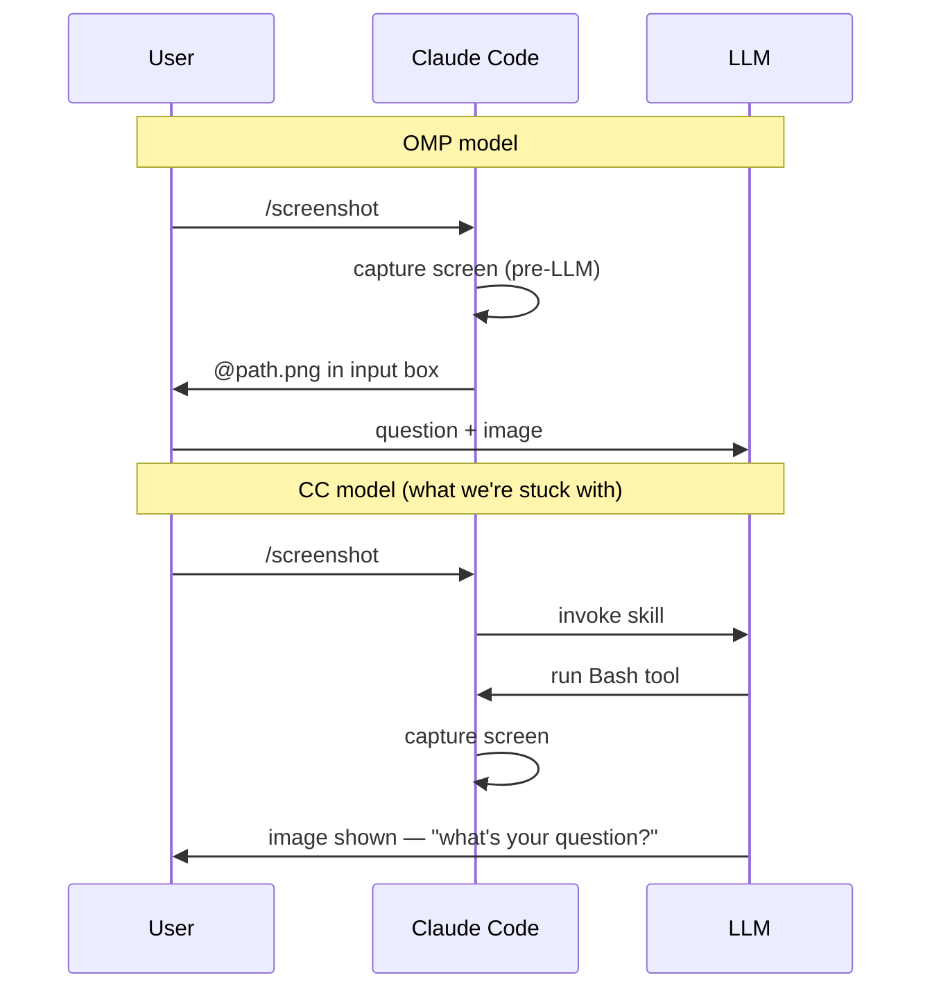
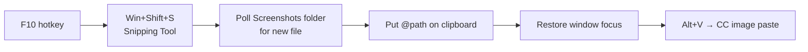

I wanted the same `/screenshot` experience in Claude Code that I built for OMP — type a command, get the screen attached, ask your question. [OMP's version took four attempts and a PTY debugging session](https://ankitg12.github.io/ai/tools/windows/2026/05/27/omp-screenshot-extension.html). Claude Code's took a different kind of pain.

---

## What I wanted

```
/screenshot
→ screen captured
→ image path in the input box
→ I type my question and hit Enter
```

One command, one second, zero friction.

---

## How OMP does it

OMP (Oh My Pi) has a proper extension API. A TypeScript file registers a slash command. The handler runs on the Node.js event loop, captures the screen via Python PIL, and prepends `@/path/to/ss.png` to the editor input. The agent sees the image. Done.

The critical part: the extension runs **before** the LLM. Image is in the input box. You type your question, submit once.

---

## Why Claude Code is different

Claude Code doesn't have a pre-LLM extension hook for injecting content into the input box. The extension model is:

- **CLAUDE.md** — persistent context
- **Skills/commands** — LLM-invoked workflows
- **Hooks** — lifecycle events (UserPromptSubmit, PreToolUse, etc.)
- **MCP** — external tool connections
- **Plugins** — packaged bundles of the above

None of these can write into the input box before the user submits. The input box is the terminal — CC has no API to pre-fill it.



---

## Attempt 1 — /screenshot as a CC command

Create `~/.claude/commands/screenshot.md`:

```markdown
Run: python3 -c "from PIL import ImageGrab; ImageGrab.grab(all_screens=True).save(r'C:/tmp/cc-screenshot.png')"
Then read C:/tmp/cc-screenshot.png and display it.
Wait for the user's question.
```

This works — but it's slow. The round-trip is:

```
user submits → LLM wakes → Bash tool starts → python3 starts → capture → return → LLM reads image
```

**Total: ~90 seconds.** PIL with `all_screens=True` is the bottleneck — it's GDI-based, not hardware-accelerated.

---

## Fix — switch to `mss`

`mss` (Multiple Screen Shots) uses DXGI on Windows — direct framebuffer access, no GDI. Benchmarks show 30-50x faster than PIL for full-screen capture.

```bash
pip install mss
```

Updated command:

```python
import mss, mss.tools
m = mss.MSS()
shot = m.grab(m.monitors[0])
mss.tools.to_png(shot.rgb, shot.size, output=r'C:/tmp/cc-screenshot.png')
```

**Still ~58 seconds.** The capture itself is fast (milliseconds). The delay is the CC Bash tool startup overhead — a process spawn round-trip through the LLM. Not fixable.

| Component | Time |
|---|---|
| LLM processing + tool invocation | ~55s |
| Python/mss capture | <1s |
| Image read | ~3s |

---

## Attempt 2 — UserPromptSubmit hook

CC hooks fire at lifecycle events. `UserPromptSubmit` fires before the LLM processes the message — but after the user submits. The hook receives the raw prompt JSON.

The idea: detect `/screenshot` in the prompt, capture the screen in the hook (outside the LLM path), inject `additionalContext` so the LLM knows the file is ready.

```json
{
  "hooks": {
    "UserPromptSubmit": [{
      "hooks": [{
        "type": "command",
        "command": "python3 -c \"import sys,json,subprocess; data=json.load(sys.stdin); p=data.get('prompt',''); (subprocess.run([...mss capture...]) or print(json.dumps({'hookSpecificOutput':{'hookEventName':'UserPromptSubmit','additionalContext':'Screenshot pre-captured at C:/tmp/cc-screenshot.png'}}))) if p.startswith('/screenshot') else None\"",
        "statusMessage": "Capturing screenshot..."
      }]
    }]
  }
}
```

This moves the capture out of the Bash tool path. The hook fires instantly, capture completes, then the LLM runs knowing the file exists.

**Result:** Capture is fast. But:
- The LLM still runs (to read the image and respond)
- The LLM still asks "what's your question?" after showing the image
- There's no way to pre-fill the input box for the next message

The hook can't write to the input box. It can only inject context Claude sees — not what appears in your terminal prompt.

---

## The real fix — AHK

The input box is a terminal input field. The only way to inject text into it from outside is to simulate keystrokes — which means AutoHotkey.



The script, adapted from [moravsky's gist](https://gist.github.com/moravsky/e521900225004ef5f8100d69a543b050):

```autohotkey
#Requires AutoHotkey v2.0

F10:: {
    prevWin := WinExist("A")  ; save currently active window
    screenshotDir := EnvGet("USERPROFILE") . "\Pictures\Screenshots"

    ; snapshot current newest file
    oldLatest := ""
    oldTime := ""
    Loop Files screenshotDir . "\*.*" {
        if (oldLatest = "" || A_LoopFileTimeModified > oldTime) {
            oldLatest := A_LoopFileFullPath
            oldTime := A_LoopFileTimeModified
        }
    }

    Send "#+s"  ; trigger Snipping Tool

    ; poll for new file (timeout 120s)
    newFile := ""
    newTime := ""
    remaining := 240
    Loop {
        Sleep 500
        remaining -= 1
        if (remaining <= 0) {
            ToolTip("Snip timed out")
            SetTimer(() => ToolTip(), -2000)
            return
        }
        newFile := ""
        newTime := ""
        Loop Files screenshotDir . "\*.*" {
            if (newFile = "" || A_LoopFileTimeModified > newTime) {
                newFile := A_LoopFileFullPath
                newTime := A_LoopFileTimeModified
            }
        }
        if (newFile != "" && newFile != oldLatest)
            break
    }

    Sleep 1500  ; wait for Snipping Tool to finish writing

    ; put @path on clipboard, refocus original window, paste
    A_Clipboard := "@" . newFile . " "
    Sleep 200
    if prevWin {
        WinActivate "ahk_id " prevWin
        WinWaitActive "ahk_id " prevWin, , 3
        Sleep 300
    }
    SendInput "!v"  ; Alt+V = CC's image paste
    ToolTip("Screenshot injected:`n" . newFile)
    SetTimer(() => ToolTip(), -3000)
}
```

Key differences from the original gist:
- Uses **Snipping Tool** (user selects region) instead of full-screen PIL capture
- Puts `@path` on clipboard instead of just the path — CC's `@` prefix triggers file attachment
- Saves the active window before snipping, restores focus after
- Sends `Alt+V` (CC's image paste key) instead of `Ctrl+V`

---

## What actually works

| Approach | Capture speed | Input injection | LLM in loop |
|---|---|---|---|
| CC command + PIL | ~90s total | No — LLM shows image | Yes |
| CC command + mss | ~58s total | No — LLM shows image | Yes |
| UserPromptSubmit hook | ~1s capture | No — still need to ask question | Yes |
| **AHK F10 hotkey** | **~2s** | **Yes — @path in input box** | **No** |

The AHK approach wins on every metric. It's not a CC extension — it's an OS-level hotkey. But it produces the exact UX I wanted.

---

## One advantage over OMP's version

OMP's `/screenshot` captures the full screen. AHK's F10 opens the Snipping Tool — you select exactly what to show. The agent sees only the relevant region, not three monitors of noise. When debugging a specific error, a UI element, or a code diff, this matters.

---

## What's needed natively

This works, but it shouldn't require AHK. CC needs either:

1. A **pre-submit hook** that can inject content into the input box before the user sends, or
2. Native support for input box pre-fill from a command handler

The [GitHub issue](https://github.com/anthropics/claude-code/issues/12644) tracking clipboard paste on Windows has been open since early 2026. moravsky's gist is the current best workaround.

---

## Setup

1. Install [AutoHotkey v2](https://www.autohotkey.com)
2. Save the script to `~/scripts/cc-hotkeys.ahk`
3. Drop a shortcut into `shell:startup` for auto-start
4. Press **F10** → draw region → **Alt+V** in CC input box

The `mss` command is still in `~/.claude/commands/screenshot.md` for when you want a quick full-screen grab without switching to AHK.

---

## References

- [moravsky's AHK gist](https://gist.github.com/moravsky/e521900225004ef5f8100d69a543b050) — the clipboard approach this is based on
- [CC issue #12644](https://github.com/anthropics/claude-code/issues/12644) — screenshot support tracking
- [python-mss docs](https://python-mss.readthedocs.io/stable/index.html) — fast cross-platform screenshot library (DXGI on Windows)
- [PIL ImageGrab docs](https://pillow.readthedocs.io/en/stable/reference/ImageGrab.html)
- [OMP screenshot extension](https://ankitg12.github.io/ai/tools/windows/2026/05/27/omp-screenshot-extension.html) — the OMP version this was inspired by
